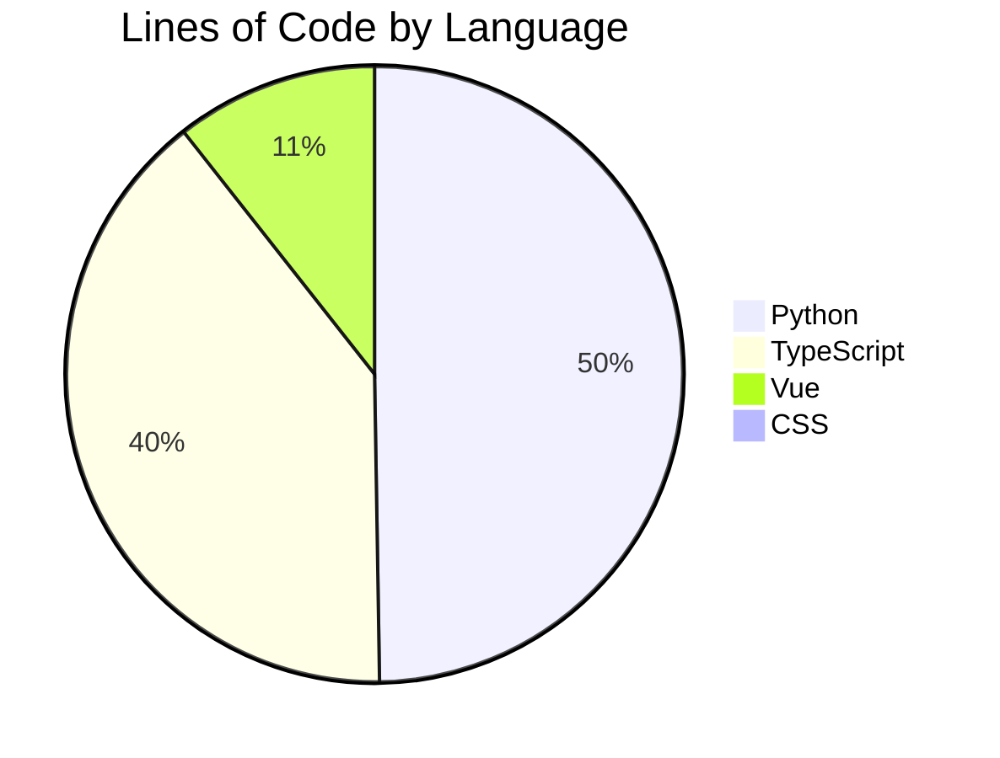

# AI3L Community Platform

<p align="center">
  
</p>

An academic exchange platform for researchers, educators, and students working on AI in language learning and literacy. Built as a full-stack async application with Vue 3, FastAPI, PostgreSQL, and Redis.

---

## Key Characteristics

**Security-focused architecture.**
Dual-layer authentication validates both JWT signature and token revocation state (stored in Redis), ensuring immediate logout effect. Additional measures include Argon2id password hashing, CAPTCHA on login/registration, CSRF double-submit cookies, Nginx IP-level rate limiting, and per-endpoint atomic rate counters. File uploads validate magic bytes before storage, and PDF files pass through pikepdf to remove embedded scripts and auto-actions.

**Structured backend with clear separation of concerns.**
All SQL resides in `app/repositories/`, with services handling business logic, endpoints handling routing, and converters handling type mapping. An in-process async event bus (with Redis persistence) decouples side-effects like notifications and audit logging from the service calls that trigger them, preventing response blocking.

**Real-time updates with multi-worker support.**
WebSocket connections use ticket-based authentication (30-second TTL, single-use) to avoid mixing session cookies with the WebSocket upgrade. Server-to-client push leverages Redis Pub/Sub for fan-out across multiple Uvicorn workers without requiring sticky sessions.

**Comprehensive test coverage.**
2,900+ backend unit tests with fully mocked asyncpg and Redis (no running database required), plus integration tests against the real database layer. 2,700+ frontend Vitest tests across 135+ files. All suites run in CI on every pull request.

**Production-oriented infrastructure.**
Docker Compose setup, Nginx TLS termination, automatic Alembic migrations on startup, Celery workers with memory-leak guards, Redis with eviction policy, and support for PostgreSQL backups, certificate renewal, GDPR compliance, and optional monitoring (Datadog/Sentry).

---

## Platform Features

### Academic Forum
- Rich-text editor (TipTap 3) with tables, inline images, and file attachments
- Full-text search with `websearch_to_tsquery` — handles special characters, AND/OR logic, and date range filtering
- Versioned post edits with full history viewer
- Threaded comments and per-comment emoji reactions
- Member post reporting with admin moderation queue
- Post co-authors for collaborative research

### Special Interest Groups (SIGs)
- Member-created groups with sub-admin delegation
- Per-SIG discussion feed and form management
- SIG-scoped member roster with role promotion

### Social & Networking
- **Friends** — send/accept/reject friend requests, unfriend
- **Follow/Unfollow** — follow other members to see their activity
- **Block list** — block users from interacting with you
- **Friend recommendations** — discover members with shared interests

### Content & Collections
- **Albums/Galleries** — organize and share research materials, images, and multimedia
- **Citations & References** — cite posts and track backlinks between related content
- **Recommendations** — content suggestions based on member interests

### Form Builder
- Seven field types: text, textarea, single_choice, multiple_choice, dropdown, rating, file_upload
- Forms lock after first response (no silent schema changes mid-collection)
- Response viewer and async CSV export via Celery task
- Auto-save draft functionality to prevent data loss

### User Profiles & Organization
- Customizable member profiles with avatars and bio
- Organization chart showing SIG structure and member roles
- Public user profiles displaying member posts

### Admin Suite
- Platform statistics dashboard with real-time metrics
- User management: ban/unban with forced session termination, bulk role change, GDPR anonymization
- Membership application review (GUEST → MEMBER promotion flow)
- Invite code lifecycle: per-member generation, soft revoke, hard delete, full audit trail
- Paginated audit log (Super Admin only): tracks LOGIN, LOGOUT, ROLE_CHANGE, BAN, INVITE_CODE_REVOKE, and more
- File audit and content moderation tools

### Security & Compliance
- VirusTotal async file scanning with scan-status polling endpoint
- Magic-byte MIME type validation before any write to object storage
- PDF sanitization via pikepdf (C++ qpdf engine): strips JS, auto-actions, macros
- GDPR Right to Erasure: deletion anonymizes PII, preserves referential integrity
- Privacy consent recorded per session (database for members, Redis for guests)
- Dual-layer rate limiting: Nginx IP zones + Redis atomic counters per endpoint
- Password policy: minimum 8 characters, requires uppercase, lowercase, digit, and special character

### Real-Time Notifications
- WebSocket push: comments, reactions, mentions, and server-initiated force-logout
- Ticket-based WebSocket auth (one-time ticket, 30-second TTL)
- Redis Pub/Sub fan-out across multiple Uvicorn workers
- Unread notification badge and notification history

### Direct Messaging
- 1-on-1 private messaging between members
- Message attachments (files) with 50MB per-message limit
- Edit and recall functionality (12-hour window)
- Read receipts for each message
- Conversation history with 50K character retention limit
- Automatic cleanup: files expire after 3 days, text after 30 days
- Respects user preferences: optional friends-only mode

### Background Tasks
Celery workers process on-demand tasks (VirusTotal scanning, CSV export). Celery Beat runs 11 scheduled operations:
- **retry_failed_events** — replay event bus failures (every 5 min)
- **sync_guest_counter** — reconcile guest session count (every 5 min)
- **auto_close_expired_forms** — close forms past deadline (every 5 min)
- **reconcile_counters** — fix post/comment counters (every 6 hours)
- **cleanup_dm_expired_files** — remove DM attachments past 3 days (hourly)
- **cleanup_dm_expired_text** — remove DM text past 30 days (hourly)
- **compute_friend_recommendations** — refresh recommendation scores (daily)
- **cleanup_old_file_scans** — purge stale VirusTotal scan records (daily)
- **cleanup_old_audit_logs** — archive old audit entries (daily)
- **cleanup_orphan_files** — remove MinIO objects with no DB reference (weekly)
- **cleanup_old_read_notifications** — prune read notifications (weekly)

### Internationalization
- Interface available in 17 languages via vue-i18n
- User language preference stored per account (`preferred_language` field)
- Locale selector available in the user profile

---

## Architecture

```
Browser
  |
  | :3000 (HTTP) / :3443 (HTTPS)
  v
Nginx  (reverse proxy · TLS termination · IP rate limiting)
  |-- /api/v1/ws  --> FastAPI  WebSocket
  |-- /api/       --> FastAPI  HTTP  :8000
  `-- /           --> Vue 3 SPA  (static build)
         |
         v
     FastAPI  :8000
         |-- asyncpg        --> PostgreSQL  :5432
         |-- redis.asyncio  --> Redis       :6379
         |-- boto3          --> MinIO       :9000
         |-- Celery tasks   --> Redis broker  DB 1
         `-- Celery results --> Redis          DB 2

All services communicate on a private Docker bridge network.
Only Nginx exposes ports to the host.
```

### Backend Request Lifecycle

```
HTTP Request
  |
  v
app/api/v1/endpoints/    Validate schema (Pydantic) · extract deps · call service
  |
  v
app/services/            Enforce auth · apply business rules · publish domain events
  |
  v
app/repositories/        All SQL via asyncpg · returns raw Records · no Pydantic
  |
  v
PostgreSQL

app/converters/          asyncpg Record --> Pydantic schema  (called by services)
app/core/event_bus.py    Async pub/sub · handlers run without blocking the response
```

### Caching & Concurrency Control

**Caching strategies:**
- User avatars: In-memory LRU cache (max 50 entries, 1-hour TTL)
- Public statistics: Redis cache (`public:stats` key, 300-second TTL)
- WebSocket tickets: Redis key-value with 30-second TTL, single-use consumption

**Pagination:**
- Cursor-based pagination with `COUNT(*) OVER()` for total count in a single query
- Form responses: Keyset pagination (`iter_responses_batched`) avoids loading entire result sets
- Post history: Capped at 50 entries per query with true total via window function

**Concurrency control:**
- Form max_respondents: PostgreSQL advisory locks (`pg_advisory_xact_lock`) serialize concurrent submissions
- Guest counter: Redis Lua script ensures atomic check-and-increment
- Member invites: Transaction-level checks prevent expired code reuse
- Audit entries: Append-only, no updates or deletes

---

## Tech Stack

### Backend

| Component | Technology |
|---|---|
| Language | Python 3.12 |
| Web framework | FastAPI + Uvicorn (uvloop) |
| Database driver | asyncpg (fully async, parameterized queries) |
| Migrations | Alembic |
| Validation | Pydantic v2 |
| Task queue | Celery + Redis |
| Password hashing | Argon2id (via passlib) |
| Token signing | PyJWT |
| Object storage | boto3 (MinIO / S3-compatible) |
| HTML sanitization | nh3 |
| PDF sanitization | pikepdf (C++ qpdf engine) |
| CAPTCHA | captcha + Pillow |
| Logging | Loguru |
| Error tracking | Sentry SDK |
| APM | ddtrace (Datadog) |

### Frontend

| Component | Technology |
|---|---|
| Framework | Vue 3 (Composition API) |
| Language | TypeScript |
| Build tool | Vite 6 |
| CSS | Tailwind CSS v4 |
| State management | Pinia |
| Routing | Vue Router 4 |
| Rich text editor | TipTap 3 |
| HTTP client | Axios (with CSRF interceptor) |
| HTML sanitization | DOMPurify |
| Internationalization | vue-i18n 11 (17 languages) |

### Infrastructure

| Component | Technology |
|---|---|
| Database | PostgreSQL 15 |
| Cache / queue broker | Redis 7 (allkeys-lru eviction, 256 MB cap) |
| Object storage | MinIO (S3-compatible) |
| Reverse proxy | Nginx 1.27 (TLS, rate limiting, static files) |
| Containerization | Docker Compose |
| Monitoring | Datadog Agent + Sentry (optional) |

---

## Quick Start

### Prerequisites

- Docker Engine 24+ and Docker Compose v2
- 8 GB RAM recommended (all services combined)
- 2 GB disk space for database, cache, and uploads

### 1. Clone and configure

```bash
git clone https://github.com/Isaries/AI3L-Community.git
cd AI3L-Community
cp .env.example .env
```

Edit `.env` and replace all `changeme_*` values:
- `SUPER_ADMIN_USERNAME` / `SUPER_ADMIN_PASSWORD` — your initial admin account
- `SECRET_KEY` — FastAPI session secret (min 32 chars)
- `JWT_SECRET_KEY` — JWT signing key
- Database, Redis, MinIO credentials
- `MINIO_PUBLIC_URL` — **must be** `http://localhost:19000` in local dev (used in presigned URLs)

### 2. Start all services

```bash
docker compose up --build   # first time — builds images and runs Alembic migrations
docker compose up           # subsequent runs
```

**On first startup:**
- PostgreSQL auto-runs Alembic migrations (schema setup)
- Redis initializes with `allkeys-lru` eviction policy
- Celery Beat starts scheduled tasks (file cleanup, guest cleanup)
- Super admin account is created from `.env` values

### 3. Initialize MinIO (first time only)

```bash
./scripts/init-minio.sh
```

Creates the upload bucket and applies access policies. Only needed once after the first `docker compose up`.

### 4. Open the application

| Service | URL | Purpose |
|---|---|---|
| Web application | http://localhost:3000 | Main SPA |
| FastAPI Swagger UI | http://localhost:18000/api/docs | API documentation (requires dev override) |
| MinIO console | http://localhost:19001 | File storage management |

### 5. Create your first member account

1. Visit http://localhost:3000
2. Click "Register" (or use an invite code from admin panel)
3. Complete CAPTCHA and registration form
4. Log in as super admin → Dashboard → approve GUEST→MEMBER promotion

---

## Troubleshooting

### `MINIO_PUBLIC_URL` not set → avatar/file URLs don't load
**Fix:** Ensure `.env` has `MINIO_PUBLIC_URL=http://localhost:19000` before starting containers.

### Port 3000 / 3443 already in use
**Fix:** Change Nginx ports in `docker-compose.yml` or kill the conflicting process.
```bash
# macOS/Linux
lsof -i :3000  # find process
kill -9 <PID>
```

### Database migration fails on `docker compose up`
**Fix:** Ensure PostgreSQL container is healthy:
```bash
docker compose logs postgres
docker compose exec postgres pg_isready
```

### Tests fail with `INTEGRATION_TEST not set`
**Note:** Unit tests run with mocked asyncpg/Redis. Integration tests require:
```bash
cd backend
INTEGRATION_TEST=1 pytest tests/ -v
```

### Frontend build hangs or Vite crashes
**Fix:** Clear node_modules and reinstall:
```bash
cd frontend
rm -rf node_modules package-lock.json
npm install
```

### OOM (Out of Memory) errors
Ensure your Docker Desktop has ≥8 GB allocated. Check individual service limits in `docker-compose.yml` (FastAPI: 3GB, PostgreSQL: 4GB, etc.).

---

## Testing

```bash
# Backend — no running database required (asyncpg and Redis are fully mocked)
cd backend
pytest tests/ -v
# ~2,900 unit tests + integration tests (set INTEGRATION_TEST=1 for integration)

# Frontend
cd frontend
npx vitest run
# ~2,700 tests across 135+ files
```

---

## Project Stats

<!-- STATS:START -->
_Last updated: 2026-03-28 — auto-generated on every push to `main`_

### Code Volume

| Metric | Value |
| --- | ---: |
| Total lines added (all commits) | +322,921 |
| Total lines removed (all commits) | -56,952 |
| Backend source lines (excl. tests) | 29,771 |
| Frontend source lines (excl. tests) | 63,365 |

### Language Breakdown



### Commit Activity


### Test Coverage

| Suite | Test cases | Source lines | Test lines |
| --- | ---: | ---: | ---: |
| Backend (pytest) | 3,609 | 29,771 | 83,873 |
| Frontend (Vitest) | 3,051 | 63,365 | 54,669 |
| **Total** | **6,660** | **93,136** | **138,542** |

Test-to-source ratio: **1.49** (138,542 lines of tests for every 93,136 lines of source)

### Additional Metrics

| Metric | Value |
| --- | ---: |
| REST API endpoints | 186 |
| Database migrations | 54 |
| Longest commit streak | 29 days |

### Top 5 Largest Source Files

| File | Lines |
| --- | ---: |
| `backend/app/services/album.py` | 1,177 |
| `frontend/src/composables/usePostDetail.ts` | 893 |
| `frontend/src/views/about/OrgChartView.vue` | 880 |
| `frontend/src/views/forms/FormView.vue` | 875 |
| `backend/app/services/dm.py` | 859 |

### Contributions by Author

| Author | Commits | Lines added | Lines removed |
| --- | ---: | ---: | ---: |
| Isaries | 492 | +319,505 | -54,487 |
| github-actions[bot] | 75 | +900 | -900 |
| SW9526 | 29 | +6,191 | -2,058 |
| dependabot[bot] | 2 | +73 | -6 |
| AI3L Community | 2 | +240 | -150 |

<!-- STATS:END -->

---

## Documentation

### Core Documentation
| Document | Purpose |
|---|---|
| [`docs/security.md`](docs/security.md) | Security architecture, threat model, controls, and design rationale |
| [`docs/authentication.md`](docs/authentication.md) | Session flow, token TTLs, CSRF, guest sessions, password policy |
| [`docs/api-reference.md`](docs/api-reference.md) | Complete REST and WebSocket API listing with auth requirements |
| [`docs/environment.md`](docs/environment.md) | All environment variable definitions, database config, cache settings |
| [`docs/deployment.md`](docs/deployment.md) | Production deployment: TLS, Nginx, migrations, backups, production checklist |
| [`docs/websocket.md`](docs/websocket.md) | WebSocket protocol: ticket auth, heartbeat, server message types |
| [`docs/system-specification.md`](docs/system-specification.md) | Full system design, data model, ERD, and feature specification |

### Architecture & Development
| Document | Purpose |
|---|---|
| [`backend/README.md`](backend/README.md) | Backend architecture, layer guide, repository patterns, testing |
| [`frontend/README.md`](frontend/README.md) | Frontend architecture, component library, composables, styling |
| [`CONTRIBUTOR_ONBOARDING.md`](CONTRIBUTOR_ONBOARDING.md) | Git setup, branch workflow, PR process, development environment |
| [`BACKEND_CONTRIBUTOR_GUIDE.md`](BACKEND_CONTRIBUTOR_GUIDE.md) | Backend open tasks with difficulty ratings and implementation guides |
| [`FRONTEND_CONTRIBUTOR_GUIDE.md`](FRONTEND_CONTRIBUTOR_GUIDE.md) | Frontend open tasks with difficulty ratings and implementation guides |

### Audit & Security Reports
| Document | Purpose |
|---|---|
| [`docs/audit/security-audit-2026-03-16.md`](docs/audit/security-audit-2026-03-16.md) | 21 security findings and fixes |
| [`docs/audit/system-bugs-2026-03-16.md`](docs/audit/system-bugs-2026-03-16.md) | 15 system bugs fixed with test coverage |
| [`docs/audit/uiux-audit-2026-03-16.md`](docs/audit/uiux-audit-2026-03-16.md) | 55 UI/UX improvements across frontend |
| [`docs/audit/backend-performance.md`](docs/audit/backend-performance.md) | Performance optimization analysis and memory hardening |
| [`docs/audit/frontend-performance.md`](docs/audit/frontend-performance.md) | Frontend performance metrics and optimization strategies |
| [`docs/audit/database-optimization.md`](docs/audit/database-optimization.md) | Database query optimization and indexing analysis |

---

## Contributing

All contributions go through pull requests targeting the `backend` or `frontend` integration branch — never directly to `main`. See [`CONTRIBUTOR_ONBOARDING.md`](CONTRIBUTOR_ONBOARDING.md) for the full workflow.

Commit messages follow [Conventional Commits](https://www.conventionalcommits.org/): `feat:`, `fix:`, `refactor:`, `test:`, `docs:`, `chore:`.

### Development Workflow

1. **New feature?** Start from the relevant `*_CONTRIBUTOR_GUIDE.md` to understand complexity, scope, and implementation order
2. **Bug fix?** Verify the bug exists with a test, then fix the root cause (not just the symptom)
3. **Performance issue?** Profile first — check the audit reports in `docs/audit/` for known bottlenecks
4. **Security concern?** Report privately; do not create a public issue

---

## Getting Help

- **Setup issues?** Check the [Troubleshooting](#troubleshooting) section above
- **Architecture questions?** Read [`docs/system-specification.md`](docs/system-specification.md) and [`backend/README.md`](backend/README.md)
- **API usage?** See [`docs/api-reference.md`](docs/api-reference.md) or visit http://localhost:18000/api/docs (Swagger UI, dev override)
- **Development patterns?** Check the relevant contributor guide for code style, file structure, and testing conventions
- **Want to contribute?** Start with [`CONTRIBUTOR_ONBOARDING.md`](CONTRIBUTOR_ONBOARDING.md) and pick a task from the contributor guides

---

## Project Status

All core features are implemented and tested. The platform is in production hardening phase — ongoing work focuses on performance optimization, security audits, and UI/UX polish.

See the [Project Stats](#project-stats) section for up-to-date metrics (auto-generated on every push to `main`).
