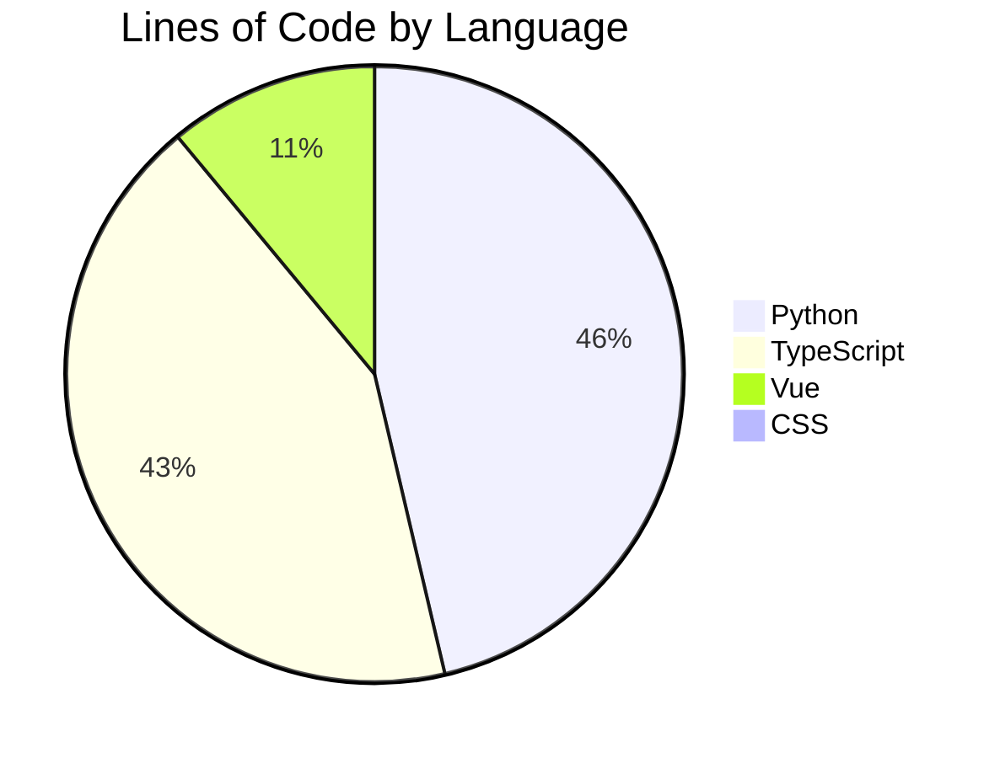

# AI3L Community Platform

A production-grade academic exchange platform for researchers, educators, and students working on AI in language learning and literacy. Full-stack, fully async, security-first.

---

## Why This Project Stands Out

**Security in depth, not as an afterthought.**
Authentication is dual-layer: every request validates the JWT cryptographic signature *and* confirms the token's `jti` exists in Redis — meaning logout and forced revocation take effect immediately, not at token expiry. On top of that: Argon2id password hashing, CAPTCHA on login and registration, CSRF double-submit cookies, Nginx IP-level rate limiting, and Redis-backed per-endpoint atomic counters.

**Files treated as untrusted data.**
Before any upload reaches object storage, the server reads the file's magic bytes to verify its true MIME type — declared content type is never trusted. PDF files then pass through pikepdf (backed by the C++ qpdf engine), which strips embedded JavaScript, auto-actions (`/AA`, `/OpenAction`), and macros before the file is stored. After storage, every file is queued for async VirusTotal scanning; clients can poll the scan result.

**A four-layer backend with zero cross-layer SQL.**
All SQL lives in `app/repositories/` and only there. Services hold business logic. Endpoints hold routing. Converters hold type mapping. No raw queries leak into services; no business rules leak into endpoints. An in-process async event bus decouples side-effects (notifications, audit writes, Celery tasks) from the service call that triggers them — handlers execute without blocking the HTTP response.

**Real-time that scales past a single worker.**
WebSocket connections authenticate with a one-time ticket (30-second TTL, consumed on connect) so session cookies never cross the WebSocket upgrade. Server-to-client push is backed by Redis Pub/Sub, fanning out across all Uvicorn workers without sticky sessions.

**Test coverage that proves it works.**
542 backend unit tests run with fully mocked asyncpg and Redis — no running database required, no flakiness. 15 integration tests cover the real database layer. 1,123 frontend Vitest tests across 84 files. All three suites run in CI on every pull request.

**Production-ready from day one.**
Docker Compose orchestration, Nginx TLS termination, automatic Alembic migrations on startup, Celery workers with memory-leak guards, Redis with `allkeys-lru` eviction, automated PostgreSQL backup and certificate renewal scripts, GDPR-compliant account erasure, and optional Datadog/Sentry instrumentation.

---

## Platform Features

### Academic Forum
- Rich-text editor (TipTap 3) with tables, inline images, and file attachments
- Full-text search with `websearch_to_tsquery` — handles special characters, AND/OR logic, and date range filtering
- Versioned post edits with full history viewer
- Threaded comments and per-comment emoji reactions
- Member post reporting with admin moderation queue

### Special Interest Groups (SIGs)
- Member-created groups with sub-admin delegation
- Per-SIG discussion feed and form management
- SIG-scoped member roster with role promotion

### Form Builder
- Seven field types: text, textarea, single_choice, multiple_choice, dropdown, rating, file_upload
- Forms lock after first response (no silent schema changes mid-collection)
- Response viewer and async CSV export via Celery task

### Admin Suite
- Platform statistics dashboard
- User management: ban/unban with forced session termination, bulk role change, GDPR anonymization
- Membership application review (GUEST → MEMBER promotion flow)
- Invite code lifecycle: per-member generation, soft revoke, hard delete, full audit trail
- Paginated audit log (Super Admin only): LOGIN, LOGOUT, ROLE_CHANGE, BAN, INVITE_CODE_REVOKE, and more

### Security & Compliance
- VirusTotal async scanning with scan-status polling endpoint
- Magic-byte MIME type validation before any write to object storage
- PDF sanitization via pikepdf (C++ qpdf engine): strips JS, auto-actions, macros
- GDPR Right to Erasure: deletion anonymizes PII, preserves referential integrity
- Privacy consent recorded per session (database for members, Redis for guests)
- Dual-layer rate limiting: Nginx IP zones + Redis atomic counters per endpoint

### Real-Time Notifications
- WebSocket push: comments, reactions, mentions, and server-initiated force-logout
- Ticket-based WebSocket auth (one-time ticket, 30-second TTL)
- Redis Pub/Sub fan-out across multiple Uvicorn workers

### Internationalization
- Interface available in 17 languages via vue-i18n
- User language preference stored per account (`preferred_language` field)
- Locale selector available in the user profile

---

## Architecture

```
Browser
  |
  | :3000 (HTTP) / :3443 (HTTPS)
  v
Nginx  (reverse proxy · TLS termination · IP rate limiting)
  |-- /api/v1/ws  --> FastAPI  WebSocket
  |-- /api/       --> FastAPI  HTTP  :8000
  `-- /           --> Vue 3 SPA  (static build)
         |
         v
     FastAPI  :8000
         |-- asyncpg       --> PostgreSQL  :5432
         |-- aioredis      --> Redis       :6379
         |-- boto3         --> MinIO       :9000
         |-- Celery tasks  --> Redis broker  DB 1
         `-- Celery results--> Redis          DB 2

All services communicate on a private Docker bridge network.
Only Nginx exposes ports to the host.
```

### Backend Request Lifecycle

```
HTTP Request
  |
  v
app/api/v1/endpoints/    Validate schema (Pydantic) · extract deps · call service
  |
  v
app/services/            Enforce auth · apply business rules · publish domain events
  |
  v
app/repositories/        All SQL via asyncpg · returns raw Records · no Pydantic
  |
  v
PostgreSQL

app/converters/          asyncpg Record --> Pydantic schema  (called by services)
app/core/event_bus.py    Async pub/sub · handlers run without blocking the response
```

---

## Tech Stack

### Backend

| Component | Technology |
|---|---|
| Language | Python 3.12 |
| Web framework | FastAPI + Uvicorn (uvloop) |
| Database driver | asyncpg (fully async, parameterized queries) |
| Migrations | Alembic |
| Validation | Pydantic v2 |
| Task queue | Celery + Redis |
| Password hashing | Argon2id (via passlib) |
| Token signing | PyJWT |
| Object storage | boto3 (MinIO / S3-compatible) |
| HTML sanitization | nh3 |
| PDF sanitization | pikepdf (C++ qpdf engine) |
| CAPTCHA | captcha + Pillow |
| Logging | Loguru |
| Error tracking | Sentry SDK |
| APM | ddtrace (Datadog) |

### Frontend

| Component | Technology |
|---|---|
| Framework | Vue 3 (Composition API) |
| Language | TypeScript |
| Build tool | Vite 6 |
| CSS | Tailwind CSS v4 |
| State management | Pinia |
| Routing | Vue Router 4 |
| Rich text editor | TipTap 3 |
| HTTP client | Axios (with CSRF interceptor) |
| HTML sanitization | DOMPurify |
| Internationalization | vue-i18n 11 (17 languages) |

### Infrastructure

| Component | Technology |
|---|---|
| Database | PostgreSQL 15 |
| Cache / queue broker | Redis 7 (allkeys-lru eviction, 256 MB cap) |
| Object storage | MinIO (S3-compatible) |
| Reverse proxy | Nginx 1.27 (TLS, rate limiting, static files) |
| Containerization | Docker Compose |
| Monitoring | Datadog Agent + Sentry (optional) |

---

## Quick Start

### Prerequisites

- Docker Engine 24+ and Docker Compose v2
- 8 GB RAM recommended (all services combined)

### 1. Clone and configure

```bash
git clone https://github.com/Isaries/AI3L-Community.git
cd AI3L-Community
cp .env.example .env
# Open .env and replace every changeme_* value with a strong random secret
```

### 2. Initialize MinIO

```bash
./scripts/init-minio.sh
```

Run this once after the first `docker compose up` to create the upload bucket and apply access policies.

### 3. Start all services

```bash
docker compose up --build   # first time — builds images and runs Alembic migrations
docker compose up           # subsequent runs
```

### 4. Open the application

| Service | URL |
|---|---|
| Web application | http://localhost:3000 |
| FastAPI Swagger UI | http://localhost:18000/api/docs |
| MinIO console | http://localhost:19001 |

A super admin account is created automatically on first startup from `SUPER_ADMIN_USERNAME` and `SUPER_ADMIN_PASSWORD` in `.env`.

---

## Testing

```bash
# Backend — no running database required (asyncpg and Redis are fully mocked)
cd backend
pytest tests/ -v
# 542 unit tests + 15 integration tests (set INTEGRATION_TEST=1 for integration)

# Frontend
cd frontend
npx vitest run
# 1,123 tests across 84 files
```

---

## Project Stats

<!-- STATS:START -->
_Last updated: 2026-03-19 — auto-generated on every push to `main`_

### Code Volume

| Metric | Value |
| --- | ---: |
| Total lines added (all commits) | +237,965 |
| Total lines removed (all commits) | -36,170 |
| Backend source lines (excl. tests) | 23,229 |
| Frontend source lines (excl. tests) | 52,757 |

### Language Breakdown



### Commit Activity


### Test Coverage

| Suite | Test cases | Source lines | Test lines |
| --- | ---: | ---: | ---: |
| Backend (pytest) | 2,457 | 23,229 | 57,736 |
| Frontend (Vitest) | 2,549 | 52,757 | 43,973 |
| **Total** | **5,006** | **75,986** | **101,709** |

Test-to-source ratio: **1.34** (101,709 lines of tests for every 75,986 lines of source)

### Additional Metrics

| Metric | Value |
| --- | ---: |
| REST API endpoints | 173 |
| Database migrations | 41 |
| Longest commit streak | 20 days |

### Top 5 Largest Source Files

| File | Lines |
| --- | ---: |
| `backend/app/services/album.py` | 978 |
| `frontend/src/composables/usePostDetail.ts` | 809 |
| `frontend/src/views/forum/PostDetailView.vue` | 757 |
| `backend/app/event_handlers.py` | 711 |
| `frontend/src/views/sigs/SigFormsView.vue` | 667 |

### Contributions by Author

| Author | Commits | Lines added | Lines removed |
| --- | ---: | ---: | ---: |
| Isaries | 322 | +235,530 | -34,651 |
| SW9526 | 23 | +5,823 | -1,670 |
| github-actions[bot] | 16 | +193 | -193 |
| dependabot[bot] | 2 | +73 | -6 |
| AI3L Community | 2 | +240 | -150 |

<!-- STATS:END -->

---

## Documentation

| Document | Contents |
|---|---|
| [`docs/security.md`](docs/security.md) | Security architecture: threat model, controls, and design rationale |
| [`docs/api-reference.md`](docs/api-reference.md) | Full REST and WebSocket API listing with auth requirements |
| [`docs/authentication.md`](docs/authentication.md) | Session flow, token TTLs, CSRF, guest sessions, password policy |
| [`docs/environment.md`](docs/environment.md) | All environment variable definitions and defaults |
| [`docs/deployment.md`](docs/deployment.md) | Production deployment: TLS, Nginx, cron jobs, production checklist |
| [`docs/websocket.md`](docs/websocket.md) | WebSocket protocol: ticket auth, heartbeat, server message types |
| [`backend/README.md`](backend/README.md) | Backend architecture deep-dive, layer guide, testing patterns |
| [`CONTRIBUTOR_ONBOARDING.md`](CONTRIBUTOR_ONBOARDING.md) | Git setup, branch workflow, PR guide for new contributors |
| [`BACKEND_CONTRIBUTOR_GUIDE.md`](BACKEND_CONTRIBUTOR_GUIDE.md) | Backend open tasks with difficulty ratings and step-by-step plans |
| [`FRONTEND_CONTRIBUTOR_GUIDE.md`](FRONTEND_CONTRIBUTOR_GUIDE.md) | Frontend open tasks with difficulty ratings and step-by-step plans |
| [`docs/system-specification.md`](docs/system-specification.md) | Full system design and feature specification |

---

## Contributing

All contributions go through pull requests targeting the `backend` or `frontend` integration branch — never directly to `main`. See [`CONTRIBUTOR_ONBOARDING.md`](CONTRIBUTOR_ONBOARDING.md) for the full workflow.

Commit messages follow [Conventional Commits](https://www.conventionalcommits.org/): `feat:`, `fix:`, `refactor:`, `test:`, `docs:`, `chore:`.
