# AI3L Community — System Architecture

A comprehensive architecture reference for the AI3L Community platform: an academic exchange community for *AI in Language Learning and Literacy* (research, posts, SIGs, events, forms, Q&A, albums, direct messaging).

> Last refreshed: 2026-05-08. Diagrams use [Mermaid](https://mermaid.js.org/) — they render natively on GitHub, VS Code, and most modern Markdown viewers.

---

## Table of Contents

1. [High-level system context (C4 — Level 1)](#1-high-level-system-context-c4--level-1)
2. [Container view (C4 — Level 2)](#2-container-view-c4--level-2)
3. [Tier & network topology](#3-tier--network-topology)
4. [Backend layered architecture](#4-backend-layered-architecture)
5. [Backend module map](#5-backend-module-map)
6. [Frontend architecture](#6-frontend-architecture)
7. [Database / persistence model](#7-database--persistence-model)
8. [Redis topology](#8-redis-topology)
9. [Object storage layout (MinIO / R2)](#9-object-storage-layout-minio--r2)
10. [Async / background work (Celery + Beat)](#10-async--background-work-celery--beat)
11. [Real-time pipeline (WebSocket + event bus)](#11-real-time-pipeline-websocket--event-bus)
12. [Request lifecycles (sequence diagrams)](#12-request-lifecycles-sequence-diagrams)
13. [Security architecture](#13-security-architecture)
14. [Deployment view](#14-deployment-view)
15. [Cross-cutting concerns](#15-cross-cutting-concerns)

---

## 1. High-level system context (C4 — Level 1)

The platform is a single web application reachable through a Cloudflare-fronted edge. Users (Guest, Member, Admin, Super-Admin) interact via browsers; the platform consumes a small set of third-party services for storage, malware scanning, and observability.

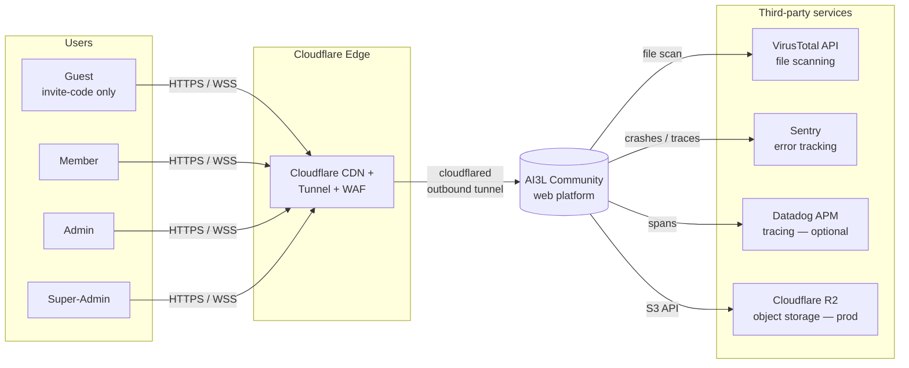

---

## 2. Container view (C4 — Level 2)

Inside the platform boundary, containers are split across two logical Docker networks (`frontend-net` and `backend-net`) plus an edge tunnel.

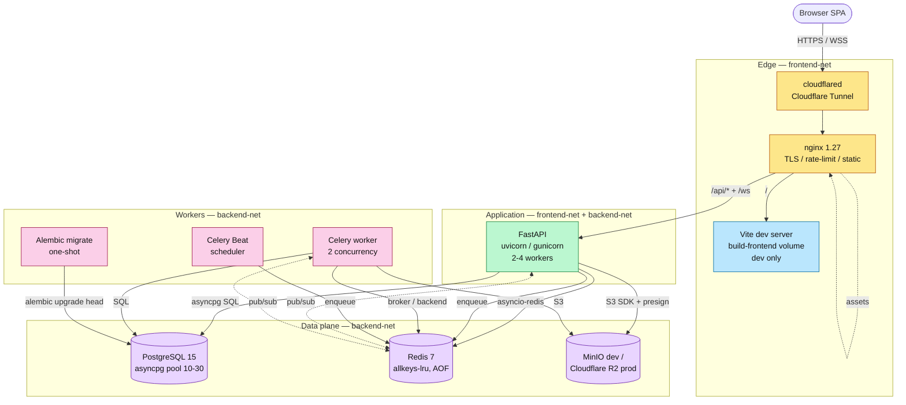

---

## 3. Tier & network topology

`docker-compose.prod.yml` enforces network tier isolation: nginx and the API live on `frontend-net`, while databases, cache, object storage, and workers live on `backend-net`. Only the API container bridges both networks.

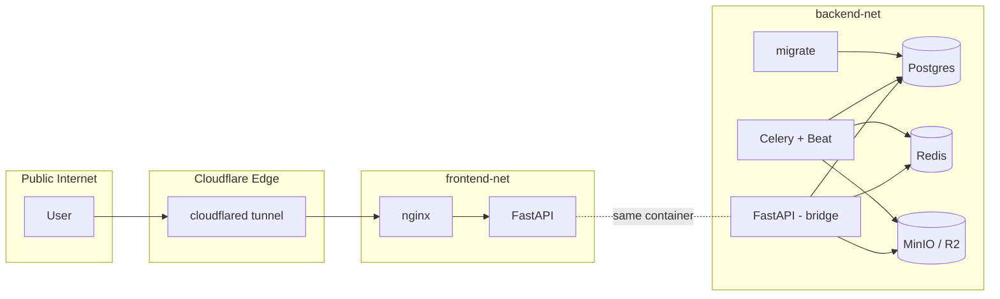

**Key invariants**

- nginx never talks to the database or Redis directly — only to FastAPI.
- The database is **never** exposed beyond `backend-net`.
- Cloudflared makes only outbound connections; no public ports are opened on the host in prod.
- nginx restores the real client IP from `CF-Connecting-IP` (Cloudflare-trusted ranges only).

---

## 4. Backend layered architecture

The FastAPI codebase follows a strict 4-layer pattern with no cross-layer imports:

```
HTTP request
   ↓ Endpoint  (app/api/v1/endpoints/*.py)        — routing, schema validation, deps
   ↓ Service   (app/services/*.py)                — business rules, transactions, events
   ↓ Repository (app/repositories/*.py)           — raw SQL + asyncpg
   ↓ Database  (PostgreSQL 15)
```

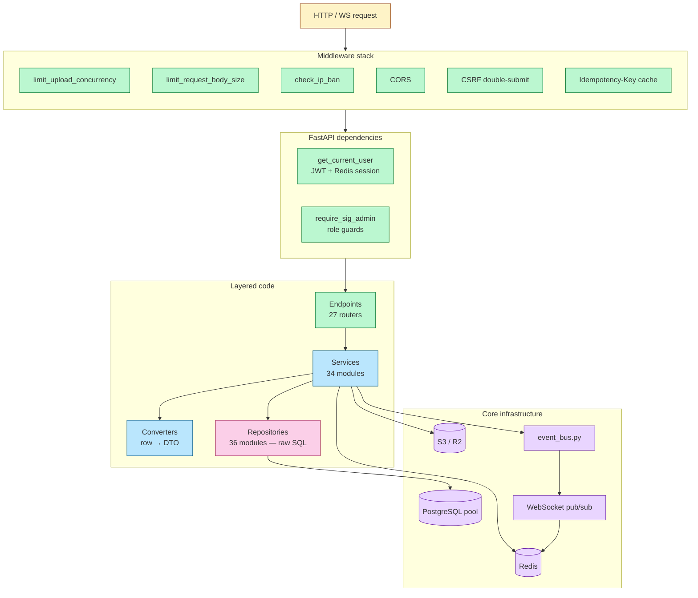

**Layering rules enforced by convention**

| Layer | May call | Must NOT call |
|---|---|---|
| Endpoint | Service, schemas, deps | Repository, raw SQL, Redis |
| Service | Repository, core (Redis/S3/event_bus), other services | FastAPI primitives, request objects |
| Repository | `asyncpg.Pool`, parameterized SQL | Services, business rules, HTTP types |
| Converter | Pure functions on rows / records | I/O, async DB |

---

## 5. Backend module map

### 5.1 API endpoints (mounted under `/api/v1`)

| Router | Prefix | Domain |
|---|---|---|
| `auth.py` | `/auth` | Login, register, guest tokens, CSRF, WS ticket |
| `users.py` | `/users` | Profiles, avatar, search, soft-delete |
| `posts.py` | `/posts` | CRUD, FTS, history, pin, reactions |
| `comments.py` | `/posts/{id}/comments` | Threaded comments, mentions, reactions |
| `sigs.py` | `/sigs` | SIG CRUD, members, roles |
| `forms.py` | `/forms`, `/sigs/{id}/forms` | Form builder, responses, exports |
| `albums.py` | `/albums` | Albums, photos, lightbox |
| `events.py` | `/events` | Calendar events, RSVP |
| `dm.py` | `/dm` | 1:1 messaging, recall, edit, admin moderation |
| `qa.py` | `/qa` | Questions, answers, votes, best answer |
| `social.py` | `/social` | Friends, follows, blocks |
| `notifications.py` | `/notifications` | List, read, deduplication |
| `recommendations.py` | `/recommendations` | Friend suggestions |
| `categories.py` | `/categories` | Tags / categories |
| `citations.py` | `/citations` | Cross-post academic refs |
| `co_authors.py` | `/co-authors` | Co-author invites |
| `applications.py` | `/applications` | SIG join requests |
| `reports.py` | `/posts/{id}/reports` | Content moderation |
| `files.py` | `/files` | Upload, scan-aware download |
| `tasks.py` | `/tasks` | Async task status |
| `preferences.py` | `/users/me/preferences` | Per-user toggles, language |
| `public.py` | `/public` | Anonymous-readable content |
| `about.py` | `/about` | Member-only contributors, org chart |
| `admin.py` + `export.py` | `/admin` | Dashboard, invites, IP bans, exports |
| `health.py` | `/health`, `/health/live` | Liveness & readiness |
| `ws.py` | `/ws` | WebSocket (ticket-authenticated) |

### 5.2 Services, repositories & converters

```mermaid
flowchart LR
    subgraph SVC[services/]
        S_auth[auth]
        S_user[user]
        S_post[post]
        S_comment[comment]
        S_sig[sig]
        S_form[form]
        S_dm[dm]
        S_album[album]
        S_event[event]
        S_qa[qa]
        S_social[social]
        S_notif[notification]
        S_recommend[recommendation]
        S_audit[audit]
        S_report[report]
        S_app[application]
        S_invite[invite_code]
        S_ipban[ip_ban]
        S_dash[dashboard]
        S_settings[site_settings]
        S_cap[captcha + captcha_math]
        S_more[+ contributor / citation /<br/>co_author / category /<br/>profile_view / org_chart /<br/>privacy_consent /<br/>member_classification /<br/>preferences]
    end

    subgraph REPO[repositories/]
        R_user[user_repo]
        R_post[post_repo]
        R_comment[comment_repo]
        R_sig[sig_repo]
        R_form[form_repo]
        R_dm[dm_repo]
        R_album[album_repo]
        R_event[event_repo]
        R_notif[notification_repo]
        R_audit[audit_repo]
        R_more[+ 27 more repos]
    end

    subgraph CONV[converters/]
        C_user[user_converter]
        C_post[post_converter]
        C_dm[dm_converter]
        C_more[+ 10 more]
    end

    SVC --> REPO
    SVC --> CONV
    CONV -. avatar URL .-> CORE_S3[(S3 presign)]
```

### 5.3 Core infrastructure (`app/core/`)

| File | Responsibility |
|---|---|
| `config.py` | Pydantic settings, env validation, derived URLs |
| `database.py` | asyncpg pool (min=10, max=30), `get_pool_stats()` |
| `redis.py` | Redis asyncio client, retry, keepalive |
| `storage.py` / `async_storage.py` | S3 client, presign with `MINIO_PUBLIC_URL` rewrite |
| `security.py` | JWT (HS256), Argon2, password policy |
| `csrf.py` | Double-submit cookie middleware |
| `rate_limit.py` | Redis Lua script per zone |
| `event_bus.py` | In-process pub/sub, retry, Redis failure log |
| `errors.py` | `ErrorCode` enum, `AppError` exception |
| `file_validation.py` | Magic numbers, OOXML/DOCX validation, sanitisation, VT trigger |
| `zip_validation.py` | Zip-slip & decompression-bomb guards |
| `blacklist.py` | User-block cache (warmed at startup) |
| `logging.py` / `logging_utils.py` | Loguru JSON, PII masking |
| `constants.py` | Pagination, rate-limit, field-length, cache TTLs |

### 5.4 Middleware order (matters)

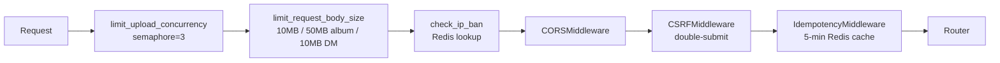

---

## 6. Frontend architecture

Single-page app: Vue 3 + TypeScript + Vite + Tailwind v4 + Pinia + vue-i18n.

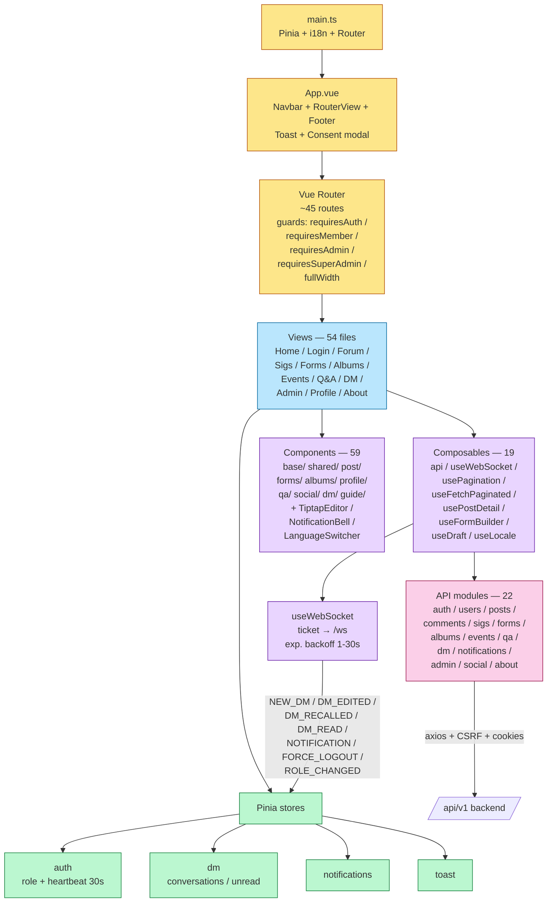

### Layout & route guards

- `route.meta.fullWidth` toggles `App.vue` `<main>` between `max-w-7xl` and full-bleed.
- `requiresAuth` → must be logged in (any role).
- `requiresMember` → blocks `isGuest`.
- `requiresAdmin` → ADMIN or SUPER_ADMIN.
- `requiresSuperAdmin` → SUPER_ADMIN only.

### Key shared abstractions

| File | Purpose |
|---|---|
| `composables/api.ts` | axios instance: `withCredentials`, CSRF header injector, 401/AUTH-code handler |
| `composables/useWebSocket.ts` | Connection lifecycle, exponential backoff, visibility pause/resume, PONG rate-limit |
| `composables/usePagination.ts` | `{page, total, totalPages, setPage, resetPage, updateFromResponse}` |
| `composables/useFetchPaginated.ts` | Paginated GET with `fetchId` stale-response guard |
| `composables/usePostDetail.ts` | Extracts PostDetailView business logic |
| `utils/error.ts` | `getErrorMessage(e, fallback)` — single API error extractor |
| `utils/sanitize.ts` | DOMPurify wrapper for user HTML |
| `utils/apiValidation.ts` | `assertShape()` runtime shape check (dev warnings) |
| `locales/` | 17 languages, lazy-loaded except English |

---

## 7. Database / persistence model

PostgreSQL 15, all migrations in `backend/alembic/versions/`. The model breaks into clear bounded contexts:

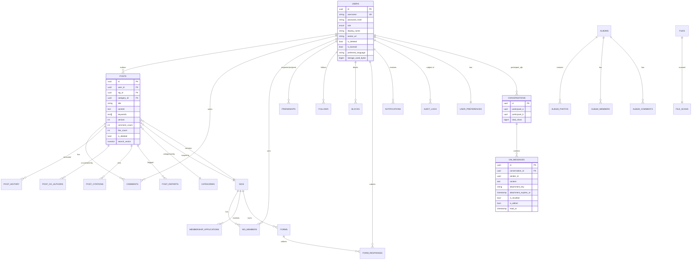

### Bounded contexts

| Context | Tables |
|---|---|
| **Identity** | `users`, `user_preferences`, `invite_codes`, `ip_bans` |
| **Forum** | `posts`, `post_history`, `comments`, `comment_votes`, `post_co_authors`, `post_citations`, `post_views`, `post_reports`, `categories` |
| **SIG** | `sigs`, `sig_members`, `membership_applications`, `contributors`, `org_chart_overrides`, `member_classifications` |
| **Forms** | `forms`, `form_responses` |
| **Notifications** | `notifications` |
| **Direct messaging** | `conversations`, `dm_messages` |
| **Social graph** | `friendships`, `follows`, `blocks`, `profile_views`, `friend_recommendations`, `dismissed_recommendations` |
| **Files & scanning** | `files`, `file_scans` |
| **Albums** | `albums`, `album_members`, `album_photos`, `album_comments` |
| **Q&A** | `questions`, `answers`, `votes` |
| **Events** | `events`, RSVP records |
| **Moderation & audit** | `post_reports`, `audit_logs` |
| **Configuration** | `site_settings` |

### Notable indexes

- GIN index on `posts.search_vector` for `websearch_to_tsquery` FTS.
- Partial index on `dm_messages(conversation_id) WHERE read_at IS NULL` (unread count perf).
- Composite index on `posts(category_id, created_at DESC)` and `comments(post_id, created_at)`.
- `conversations` enforces `participant_a < participant_b` so each pair has one row.
- Unique constraints: `users.username`, `invite_codes.code`, `sigs.name`, `friendships(requester, recipient)`, `follows(follower, following)`, `blocks(blocker, blocked)`.

---

## 8. Redis topology

Redis 7, `allkeys-lru`, `maxmemory 256mb`, AOF `everysec` in production. It is the **only** mutable shared state outside Postgres.

```mermaid
flowchart LR
    subgraph Redis[Redis 7 — allkeys-lru, AOF]
        SES[Sessions<br/>session:{jti} → user_id<br/>TTL = role-based]
        WST[WS tickets<br/>ws_ticket:{token}<br/>TTL = 30s]
        GST[Guest tokens<br/>guest:{id} TTL=45m]
        CAP[Captchas<br/>captcha:{user} TTL=5m]
        AVA[Avatars cache<br/>avatar:{user} TTL=1h]
        RL[Rate-limit counters<br/>rate_limit:{zone}:{ip}]
        IPB[IP ban set]
        BLK[Block list cache<br/>warmed on startup]
        EVT[Event bus failures<br/>event_bus:failed list]
        DDP[Dedup<br/>event_bus:dedup:{id} TTL=10m<br/>view_dedup:* TTL=24h]
        IDM[Idempotency<br/>idempotency:{user}:{key} TTL=5m]
        PUB[Pub/Sub channels<br/>ws:notify, dm broadcast]
        BRK[Celery broker<br/>+ result backend<br/>db=0]
        STA[Public stats<br/>public:stats TTL=300s]
        CNT[Guest counter<br/>Lua atomic SETNX]
    end
```

### Key namespaces

| Pattern | TTL | Purpose |
|---|---|---|
| `session:{jti}` | role-based (45m–8h) | JWT-paired session record |
| `ws_ticket:{token}` | 30s | WebSocket auth handshake |
| `guest:{id}` | 45 min | Guest user session |
| `captcha:{user}` | 5 min | Math captcha challenge |
| `avatar:{user}` | 1h | LRU cache, max 50 entries |
| `rate_limit:{zone}:{ip}` | window | Lua script counter |
| `event_bus:failed` | — | List of permanently failed events |
| `event_bus:dedup:{event_id}` | 10 min | Idempotent event processing |
| `idempotency:{user}:{key}` | 5 min | Replay-safe POST/PUT |
| `view_dedup:post:*`, `view_dedup:profile:*` | 24h | View-count dedup |
| `public:stats` | 300s | Cached homepage stats |
| `guest_counter` | — | Atomic SETNX/INCR Lua script |
| `ws:notify` (channel) | — | Pub/Sub fan-out across workers |

---

## 9. Object storage layout (MinIO / R2)

`storage.py` rewrites internal `http://minio:9000` URLs to `MINIO_PUBLIC_URL` in presigned links so browsers can fetch. In production this points at Cloudflare R2.

```
ai3l-uploads/
├── avatars/{user_id}/{filename}              ← 2 MB cap
├── posts/{post_id}/{filename}
├── posts/{post_id}/thumbnails/{filename}
├── albums/{album_id}/cover/{filename}        ← 5 MB cap
├── albums/{album_id}/{filename}              ← 10 MB cap per photo
├── dm/{sender_id}/{uuid}_{filename}          ← 10 MB cap, 3-day TTL
├── exports/user/{user_id}/site-export-*.zip  ← 7-day TTL
├── exports/form/{form_id}/form-export-*.csv  ← 7-day TTL
└── tmp/                                      ← scratch, manual cleanup
```

**Cleanup tasks** (Celery Beat) — see §10.

**File scanning pipeline**

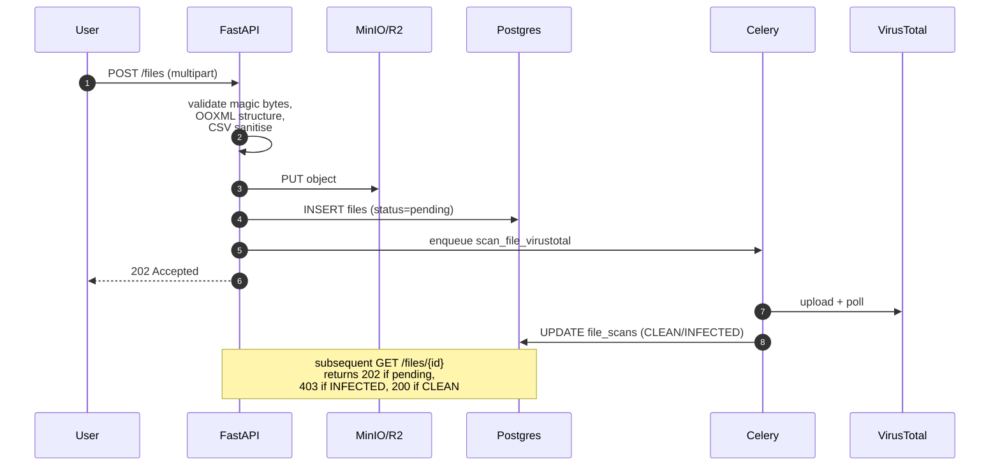

---

## 10. Async / background work (Celery + Beat)

Celery is configured with **late ack**, **prefetch=1**, and `--max-memory-per-child=256000` to bound memory. Single Beat replica (replicas:1 in compose) prevents duplicate scheduling.

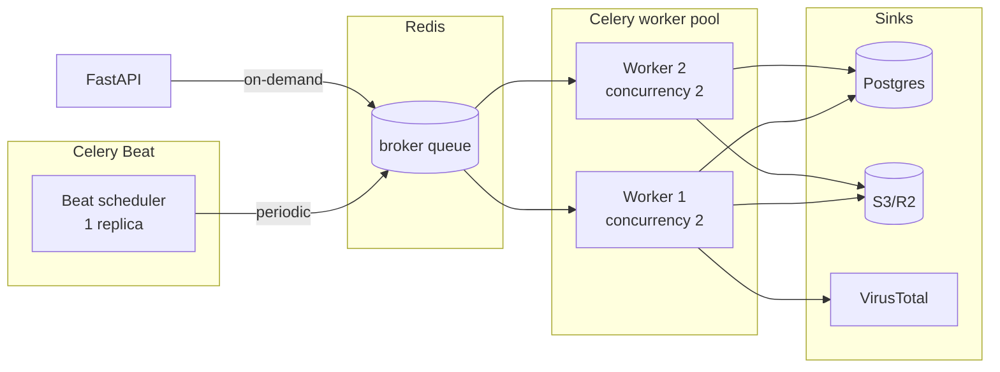

### Scheduled jobs (Beat)

| Task | Schedule | Purpose |
|---|---|---|
| `retry_failed_events` | every 5 min | Drain `event_bus:failed` |
| `sync_guest_counter` | every 5 min | Reconcile guest_counter |
| `auto_close_expired_forms` | every 5 min | Close past-deadline forms |
| `reconcile_counters` | every 6h | Heal denormalised counts |
| `cleanup_dm_expired_files` | hourly | Purge DM attachments past TTL |
| `cleanup_dm_expired_text` | hourly | 7-day text retention |
| `cleanup_old_file_scans` | daily | Drop scan rows > 30d |
| `cleanup_old_audit_logs` | daily | Archive audit > 1y |
| `cleanup_old_site_exports` | daily | Drop exports > 7d |
| `cleanup_dm_orphan_files` | daily | DM orphan FS cleanup |
| `compute_friend_recommendations` | daily | Score graph |
| `cleanup_orphan_files` | weekly | Drop S3 with no DB ref |
| `cleanup_old_read_notifications` | weekly | Drop read > 90d |
| `cleanup_dm_orphan_quotas` | weekly | Stale DM quota rows |
| `cleanup_empty_dm_conversations` | weekly | Drop zero-message convos |
| `cleanup_dismissed_recommendations` | weekly | Drop dismissed > 90d |

### On-demand jobs

| Task | Trigger |
|---|---|
| `export_form_csv` | User export request |
| `site_export` | User data export request (GDPR) |
| `generate_thumbnail` | Album/photo upload |
| `scan_file_virustotal` | File upload (when `VT_API_KEY` set) |

---

## 11. Real-time pipeline (WebSocket + event bus)

Two complementary mechanisms:

1. **In-process event bus** (`app/core/event_bus.py`) — synchronous-looking async pub/sub for cross-service notifications inside one worker. Handlers retry up to `MAX_RETRIES=2`, then push to `event_bus:failed` for Celery retry.
2. **Redis Pub/Sub** — fan-outs WebSocket events across multiple FastAPI workers so users connected to *any* worker receive their messages.

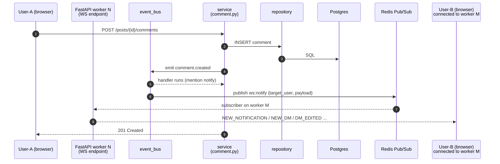

### WebSocket auth handshake (ticket-based)

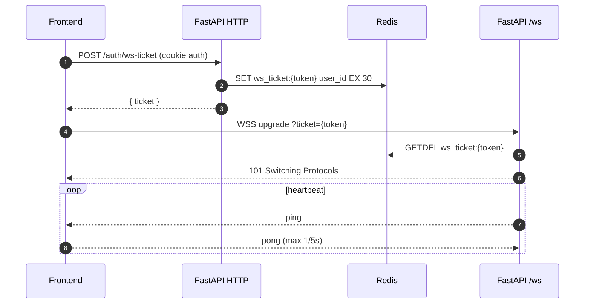

### Event types pushed over WS

| Event | Source | Target |
|---|---|---|
| `NEW_NOTIFICATION` | notification service | recipient |
| `NEW_DM` / `DM_EDITED` / `DM_RECALLED` / `DM_READ` | dm service | both participants |
| `ROLE_CHANGED` | user/auth service | the user (forces UI re-evaluation) |
| `FORCE_LOGOUT` | auth/admin | the user (ban or session revoke) |

---

## 12. Request lifecycles (sequence diagrams)

### 12.1 Login (member)

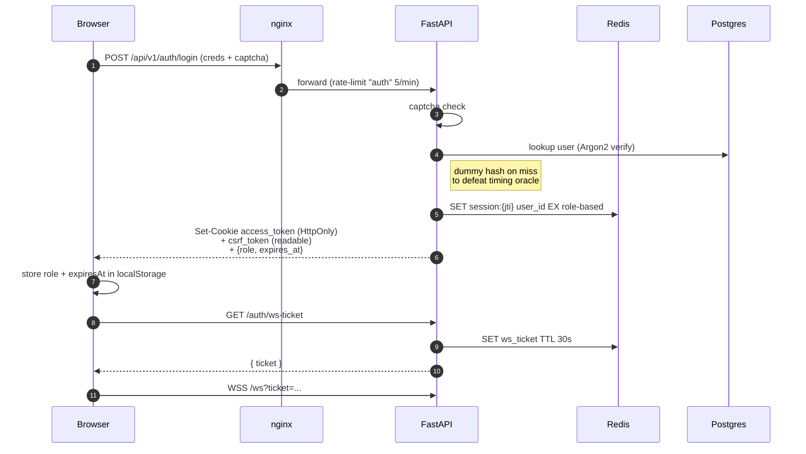

### 12.2 Create post with mention

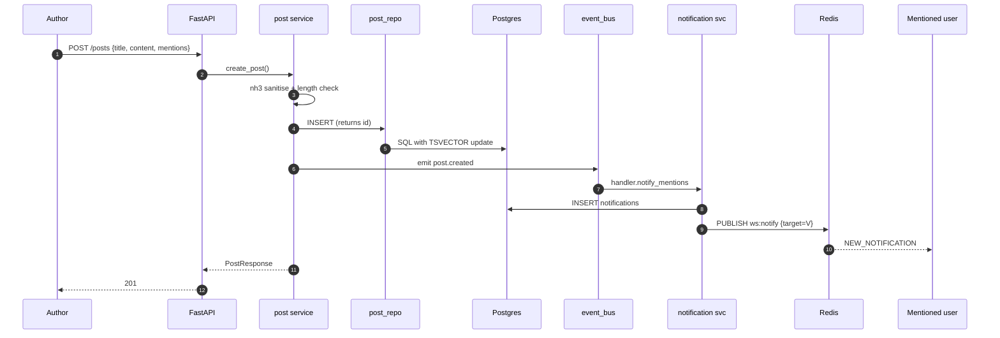

### 12.3 DM send with attachment

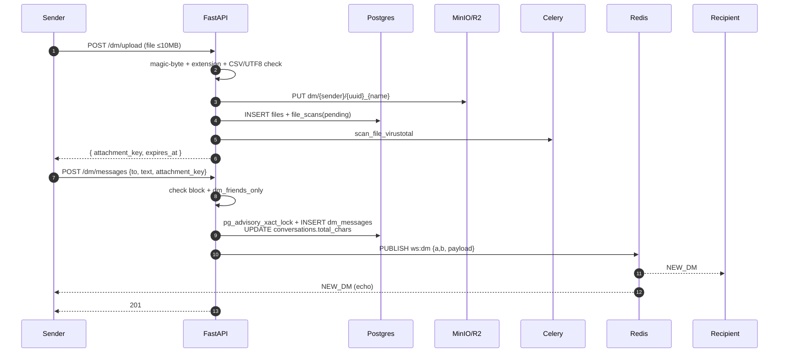

### 12.4 Form submission with quota

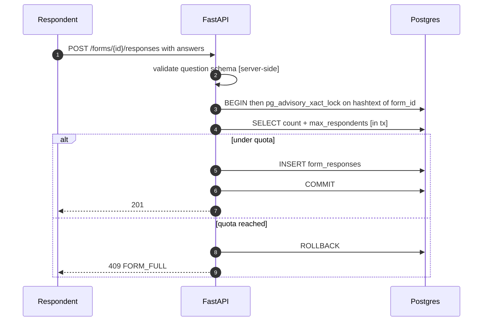

---

## 13. Security architecture

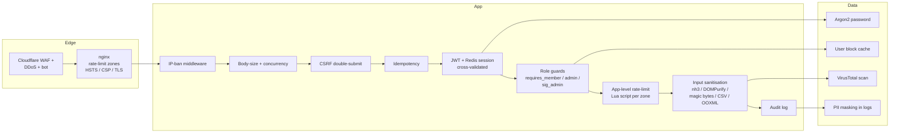

### Highlights

- **Auth**: `access_token` is HttpOnly + Secure + SameSite. CSRF via readable `csrf_token` cookie + `X-CSRF-Token` header (double-submit).
- **JWT–Session cross-check**: every authed request validates the JWT *and* looks up `session:{jti}` in Redis — revocation is one DEL away.
- **Timing oracle**: `_DUMMY_HASH` Argon2 in `services/auth.py` is hashed for non-existent / deleted / banned users to keep login wall-clock constant.
- **CSP**: nginx hardcodes `http://localhost:19000` in dev; in prod `STORAGE_CSP_ORIGIN` substitutes the R2 origin via `docker-entrypoint.sh` envsubst.
- **Rate-limit zones (nginx)**: `auth` 5/m, `write` 5/m, `dm_write` 30/m, `global` 20/s, `ws_conn` 5 concurrent/IP.
- **VirusTotal**: every uploaded file is scanned async; pending → 202, infected → 403, clean → 200.
- **Audit log**: every privileged mutation (role change, ban, delete, IP ban) writes to `audit_logs` with masked IP.
- **Container hardening**: `security_opt: no-new-privileges`, `cap_drop: ALL` on PG/Redis/MinIO; nginx runs `server_tokens off`; Redis password via env (not visible in `docker inspect`).

---

## 14. Deployment view

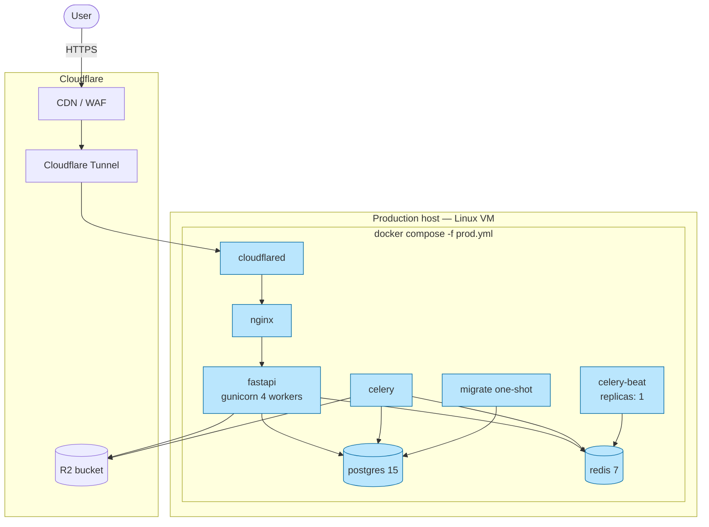

### Build & release

| Step | Command |
|---|---|
| Build images | `docker compose -f docker-compose.prod.yml build` |
| Start migrate first | `docker compose ... up migrate` |
| Bring up stack | `docker compose ... up -d` |
| Tail logs | `docker compose ... logs -f fastapi nginx celery` |
| Apply env change | `docker compose ... up -d <svc>` (NOT `restart`) |

### Dev workflow

- `docker compose up` (or `--build` after package change) starts everything.
- `build-frontend` one-shot writes Vite dist into `nginx-html` volume — nginx always serves the latest static build.
- nginx dev config uses `resolver 127.0.0.11 valid=5s` + `set $var` so service IP changes don't 502.
- `MINIO_PUBLIC_URL=http://localhost:19000` **must** be set in `.env` for browser-accessible presigned URLs.

---

## 15. Cross-cutting concerns

### Observability

- **Logging**: Loguru JSON to stdout; nginx JSON access logs; Docker `json-file` driver with 50 MB × 5 rotation.
- **Tracing**: Optional Datadog APM via `DD_AGENT_HOST` / `DD_TRACE_ENABLED`.
- **Errors**: Sentry SDK with `SENTRY_TRACES_SAMPLE_RATE=0.1`.
- **Health**: `GET /health/live` (public), `GET /health` (super-admin only — exposes pool stats).

### Configuration

`app/core/config.py` is the single source of truth. Production rejects:

- `S3_ACCESS_KEY_ID=minioadmin`
- CORS origins containing `localhost`
- `FASTAPI_DEBUG=true`
- Empty `COOKIE_DOMAIN` (warns)
- Cloud-synced project folder (warns at startup)

### i18n

- 17 languages in `src/locales/` (English bundled, others lazy).
- `users.preferred_language` stored in DB, applied on login.
- `document.documentElement.lang` updated by `useLocale()` for accessibility.
- Dates formatted via `utils/date.ts:formatDate(date, locale)` — never raw `.toLocaleDateString()`.

### Pagination convention

`COUNT(*) OVER()` single-query pattern in repositories returns `(rows, total)`. Frontend `usePagination` and `useFetchPaginated` consume `{items, total}` shape.

### Idempotency

POST/PUT supporting `Idempotency-Key` header are cached in Redis at `idempotency:{user}:{key}` for 5 minutes; same key returns the original response body.

---

## Appendix A — File counts (current snapshot)

| Layer | Files |
|---|---|
| Backend endpoints | 27 routers |
| Backend services | 34 modules |
| Backend repositories | 36 modules |
| Backend converters | 13 modules |
| Backend schemas | 24 modules |
| Backend tasks | 11 modules / ~16 scheduled jobs |
| Backend core infra | 18 modules |
| Frontend views | 54 |
| Frontend components | 59 |
| Frontend composables | 19 |
| Frontend API modules | 22 |
| Frontend stores | 4 |
| Frontend types | 18 |
| Frontend locales | 17 languages |
| Backend unit tests | ~3,693 |
| Frontend Vitest tests | ~3,066 |

## Appendix B — Where to look

| Question | File |
|---|---|
| HTTP entrypoint, middleware order, lifespan | `backend/app/main.py` |
| Settings & env validation | `backend/app/core/config.py` |
| Celery schedule | `backend/app/celery_app.py` |
| Event bus contract | `backend/app/core/event_bus.py` + `event_handlers.py` |
| Migration history | `backend/alembic/versions/` |
| Frontend bootstrap | `frontend/src/main.ts` + `App.vue` |
| Router map & guards | `frontend/src/router/index.ts` |
| WS lifecycle | `frontend/src/composables/useWebSocket.ts` |
| Compose topology | `docker-compose.yml` / `.override.yml` / `.prod.yml` |
| Edge config | `nginx/nginx.conf`, `nginx/conf.d*/default.conf`, `nginx/snippets/security-headers.conf` |
